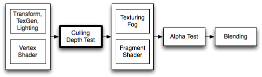
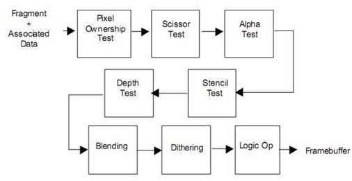

>**unity官方引导**

[顶点片元官方引导](https://docs.unity3d.com/Manual/ShaderTut2.html)

>**ZWrite、ZTest**

*需要注意的是，当ZTest取值为Off时，表示的是关闭深度测试，等价于取值为Always，而不是Never！Always指的是直接将当前像素颜色(不是深度)写进颜色缓冲区中；而Never指的是不要将当前像素颜色写进颜色缓冲区中，相当于消失。*

在ZTest通过的情况下：

| ZWrite | ZTest | 是否写入深度缓存 | 是否写入颜色缓存 |
| ------ | ----- | ---------------- | ---------------- |
| On     | On    | 写入             | 写入             |
| On     | Off   | 不写入           | 不写入           |
| Off    | On    | 写入             | 不写入           |
| Off    | Off   | 不写入           | 不写入           |

可以看出ZWrite在ZTest打开并通过时，是直接关系是否写入颜色。ZTest的通过与开关是直接关系是否写入深度缓存。

**参考文章：**

https://blog.csdn.net/lyh916/article/details/45317571
https://docs.unity3d.com/Manual/SL-CullAndDepth.html

>**SubShader的Tag**

**RenderType**

可以使用Camera.RenderWithShader或者Camera.SetReplacementShader方法来替换相机照的的物体的shader。

- 使用Camera.SetReplacementShader("ShaderA","")后，把相机照的所有shader替换成ShaderA渲染。
- 使用Camera.SetReplacementShader("ShaderA","RenderType"),把相机照到所有的shader中RenderType与ShaderA中的RenderType一样的Shader替换成ShaderA渲染，其余的不做渲染。

当然这个方法也可以使用其他Tag来做替换，在unity内置会有使用RenderType来替换的优化方案。

**参考文章：**

http://www.luzexi.com/2018/08/08/Unity3D%E9%AB%98%E7%BA%A7%E7%BC%96%E7%A8%8B%E4%B9%8B%E8%BF%9B%E9%98%B6%E4%B8%BB%E7%A8%8B-Shader4.html

>**Blend**

>**Stencil**

模板测试判断依据

和深度测试一样，在unity中，每个像素的模板测试也有它自己一套独立的依据，具体公式如下：

    if（referenceValue&readMaskcomparisonFunction  stencilBufferValuereadMask）
        通过像素
    else
        抛弃像素

在这个公式中，主要分comparisonFunction的左边部分和右边部分

referenceValue是有Ref来定义的，这个是由程序员来定义的，readMask是模板值读取掩码，它和referenceValue进行按位与（&）操作作为公式左边的结果，默认值为255，即按位与（&）的结果就是referenceValue本身。

stencilBufferValue是对应位置当前模板缓冲区的值，同样与readMask做按位掩码与操作，结果做为右边的部分

comparisonFunction比较操作通过Comp命令定义，公式左右两边的结果将通过它进行判断，其取值及其意义如下面列表所示。

ugui的mask就是使用的这个来实现的，所以我们在写一个ui的shader的时候需要我们编写：

    Stencil
    {
        Ref [_Stencil]
        Comp [_StencilComp]
        Pass [_StencilOp]
        ReadMask [_StencilReadMask]
        WriteMask [_StencilWriteMask]
    }
    
    ColorMask[_ColorMask]

**参考文章：**

https://docs.unity3d.com/Manual/SL-Stencil.html
https://gameinstitute.qq.com/community/detail/127404
https://www.jianshu.com/p/0320ceffbfa8
https://blog.csdn.net/liu_if_else/article/details/86316361